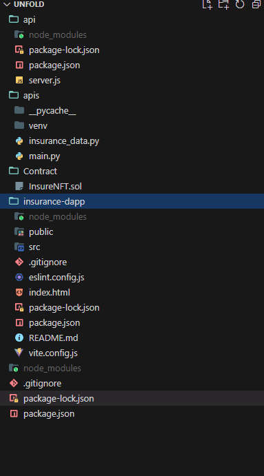
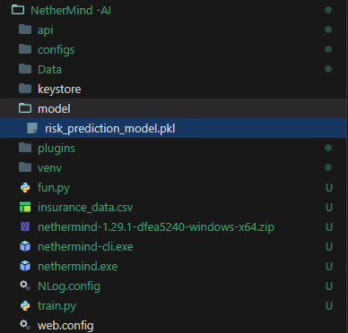
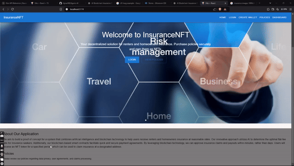

# Unfold - AI & Blockchain Insurance Solution

## Overview
Unfold is an innovative platform that leverages Artificial Intelligence (AI) and Blockchain to revolutionize the insurance industry. It aims to provide renters and homeowners with affordable insurance solutions by automating rate calculations, policy issuance, and claim settlements.

This project focuses on:
- **Transparency**: Smart contracts enable verifiable and tamper-proof policies and claims.
- **Efficiency**: AI dynamically assesses risks for optimal pricing, while blockchain automates claim payouts within minutes.
- **Accessibility**: Blockchain-backed NFTs represent insurance policies, allowing users to securely manage and claim insurance.

## Key Features
### AI-Driven Insurance Rate Optimization
- Uses machine learning models to calculate the most affordable and fair insurance rates based on user inputs (age, income, property details, etc.).

### Smart Contract-Based Automation
- Policies are issued as NFTs (ERC-721 tokens) with encoded terms.
- Blockchain automates premium collection, claim approvals, and payouts.

### Policy NFTs
- Users receive an NFT representing their insurance policy, stored securely on the blockchain.
- NFTs can encode terms like coverage period, premium amount, and claim conditions.

### Instant Claims Processing
- Claims are assessed in real-time using AI.
- Valid claims are approved and paid out instantly via blockchain.

### Decentralized and Secure
- Policies and claims are immutable and transparent on the blockchain.
- Policy metadata is stored on IPFS for decentralized access.

## Repository Structure



## Technologies Used
### Frontend (DApp)
- **React + Vite**: For a fast, responsive user interface.
- **Pages**: Login, Wallet Creation, Insurance, Dashboard.
- **Uses Axios/Fetch for API Calls**.

### Backend
- **Node.js**: 
  - Manages Okto API Calls.
  - Handles Wallet Creation.
  - Processes Claims via Smart Contracts.
- **FastAPI**: 
  - Recommends Policies.
  - Filters Eligibility.
  - Optimizes Premium Calculations.

### Blockchain
- **Ethereum Smart Contracts**: 
  - NFT Minting (ERC-721).
  - Policy Management.
  - Claim Validation.
  - Instant Payouts.

### Third-Party APIs
- **Okto API**: 
  - Wallet Creation.
  - Token Transactions.
  - Portfolio Management.

## AI Architecture

## How Our AI Works
The AI component of our application utilizes a machine learning model to assess user risk levels and recommend insurance policies. The process includes:

1. **Data Collection**: User inputs such as age, income, and property details are collected.
2. **Risk Prediction**: The AI model (`risk_prediction_model.pkl`) processes the data to predict the user's risk level (Low, Medium, High).
3. **Policy Recommendation**: Based on the predicted risk level, the backend suggests optimal policies with dynamic premiums and coverage amounts.

### AI Model Training
The AI model is trained using historical insurance data to ensure accurate risk assessments. The training process involves:

- Loading the dataset.
- Defining features (age, income, property value) and target (risk level).
- Training a Random Forest Classifier.
- Saving the trained model for real-time predictions.

---

## **NetherMind-AI: Decentralized Insurance Solution**

### Folder Structure of NetherMind trained node of our AI



## **Overview**

NetherMind-AI combines the power of **Artificial Intelligence (AI)** and **Blockchain** to create an advanced insurance solution. This system dynamically evaluates user risk profiles using AI and issues blockchain-backed policies represented as **NFTs (ERC-721 tokens)**. Leveraging **Nethermind**, the Ethereum client, this solution ensures reliability, transparency, and scalability in policy management and claim settlements.

---

## **Key Features**

1. **AI Risk Assessment**:
   - Uses a machine learning model (`risk_prediction_model.pkl`) to predict user risk levels based on personal and property data.
   - Generates optimal policy suggestions with dynamic premiums and coverage amounts.

2. **Blockchain Integration with Nethermind**:
   - Nethermind serves as the Ethereum client to handle smart contract interactions.
   - Processes NFT minting for policy issuance and manages claims on the blockchain.

3. **Smart Contract Automation**:
   - Implements Solidity smart contracts to issue policies and automate claim validation.
   - Policies are immutable and stored securely on-chain.

4. **Decentralized and Secure**:
   - Policies are represented as NFTs, ensuring tamper-proof records.
   - User transactions are processed via MetaMask for seamless blockchain interaction.

---

## **Workflow**

1. **User Interaction**:
   - Users enter details (age, income, property value) in the DApp.
   - The frontend sends this data to the backend.

2. **AI Risk Assessment**:
- Backend calls the Flask API to predict the user's risk level.
   - Flask API uses `risk_prediction_model.pkl` to process the data.

3. **Policy Recommendation**:
   - Backend suggests policies based on the predicted risk level.
   - Policies include dynamic premiums and coverage amounts.

4. **Policy Issuance (Blockchain)**:
   - Backend interacts with the Nethermind Ethereum client to:
     - Mint a policy NFT.
     - Store policy metadata on-chain.

5. **Claims**:
   - Users can submit claims via the DApp.
   - Smart contracts validate and settle claims automatically.

---

## **Setup Guide**

### **1. Train the AI Model**
Use the `train.py` script to train the AI model and generate `risk_prediction_model.pkl`.

#### **train.py**

## How to Access the Project

### Prerequisites
- **Node.js (v16+)**: For running the backend and frontend.
- **Python (v3.8+)**: For the AI server.
- **Hardhat**: For smart contract deployment.
- **Metamask Wallet**: For interacting with the blockchain.
- **Ganache/Testnet**: For blockchain testing (use Polygon Mumbai or Ethereum Sepolia).
## Video Overview
For a visual overview of the Unfold project, check out our video: [Unfold Project Overview](https://youtu.be/bS0XjBB2_PY)

### Step-by-Step Guide
1. **Clone the Repository**
   ```bash
   git clone https://github.com/your-repo/unfold.git
   cd UNFOLD
   ```

2. **Set Up the AI API**
   Navigate to the `apis/` directory:
   ```bash
   cd apis
   ```
   Create a virtual environment:
   ```bash
   python -m venv venv
   source venv/bin/activate  # For Linux/Mac
   venv\Scripts\activate     # For Windows
   ```
   Install dependencies:
   ```bash
   pip install -r requirements.txt
   ```
   Run the Flask server:
   ```bash
   python main.py
   ```

3. **Set Up the Blockchain Backend**
   Navigate to the `api/` directory:
   ```bash
   cd ../api
   ```
   Install dependencies:
   ```bash
   npm install
   ```
   Start the Node.js server:
   ```bash
   node server.js
   ```

4. **Deploy the Smart Contract**
   Navigate to the `Contract/` directory:
   ```bash
   cd ../Contract
   ```
   Deploy the smart contract using Hardhat:
   ```bash
   npx hardhat run scripts/deploy.js --network <network_name>
   ```
   Copy the deployed contract address and update it in `server.js`.

5. **Set Up the Frontend**
   Navigate to the `insurance-dapp/` directory:
   ```bash
   cd ../insurance-dapp
   ```
   Install dependencies:
   ```bash
   npm install
   ```
   Start the development server:
   ```bash
   npm run dev
   ```
   Open the app in your browser (default: http://localhost:3000).

## Project Flow
1. **User Registration**
   - Users enter their details (name, age, income) on the DApp.
   - The AI backend calculates the optimal insurance rate.

2. **Policy Issuance**
   - Upon approval, the backend interacts with the smart contract to mint an NFT representing the policy.
   - Users receive the NFT in their wallet.

3. **Claims**
   - Users can initiate claims via the DApp by submitting their policy NFT.
   - Smart contracts validate the claim and approve payouts instantly.

## Smart Contract Details
### InsureNFT.sol
- **Purpose**: To issue NFTs as policies and manage claims.
- **Standards**: ERC-721.

### Key Functions:
- `mintPolicyNFT`: Issues a new policy NFT.
- `processClaim`: Approves or denies claims based on policy metadata.

## Future Improvements
- **Multi-Chain Support**: Enable policy creation and claims on multiple blockchains.
- **Decentralized Metadata Storage**: Use IPFS or Arweave for policy metadata storage.
- **Dynamic Premiums**: Implement AI models for real-time premium adjustments.
- **Mobile Integration**: Develop a mobile app for easier access.

## Contributing
We welcome contributions to improve this project. Please follow these steps:
1. Fork the repository.
2. Create a feature branch.
3. Submit a pull request with your changes.

## License
<<<<<<< HEAD
This project is licensed under the MIT License. See the LICENSE file for details.
=======
This project is licensed under the MIT License. See the LICENSE file for details.
>
